# Registro de evidencias — Pedidos360 (EP1 / EP2)

Mini-informe del sistema funcionando. Cada punto tiene la foto que lo prueba,
qué demuestra y cómo repetirlo. Sirve como anexo para AVA/email y como guion
de la presentación.

## Cómo agregar una foto

1. Guarda la captura en la carpeta `docs/evidencias/` con nombre ordenado
   (ej: `01-cuenta-chips.png`).
2. Reemplaza la línea `<!-- foto: ... -->` por:
   ``
3. En GitHub la foto se ve sola. Para el email al profesor adjunta las fotos
   o exporta este archivo a PDF.

## 1. Login con Microsoft y tokens

- [x] **Mi cuenta con nombre, roles y scopes**
  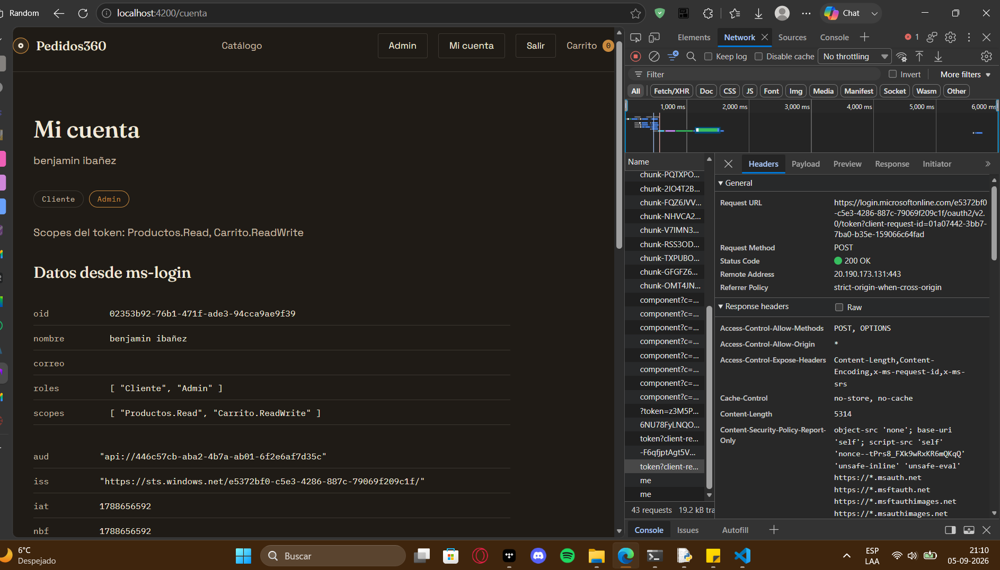
  Qué demuestra: el login con Microsoft entrega un token con los permisos
  esperados (roles Cliente/Admin, scopes Productos.Read y Carrito.ReadWrite).
  Cómo repetirla: Ingresar → Continuar con Microsoft → abrir Mi cuenta.

- [x] **Datos del usuario según ms-login**
  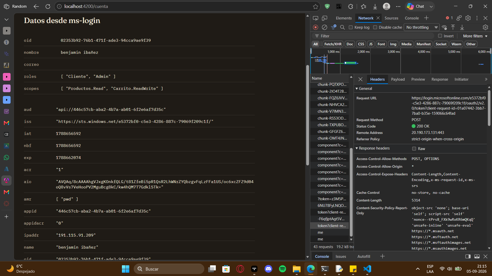
  Qué demuestra: el microservicio ms-login lee el token y devuelve los datos
  del usuario (sección "Datos desde ms-login" en Mi cuenta).
  Cómo repetirla: con sesión iniciada, abrir Mi cuenta y bajar a esa sección.

## 2. Acceso bloqueado sin login (401)

- [x] **Agregar sin login: error 401 real en consola y red**
  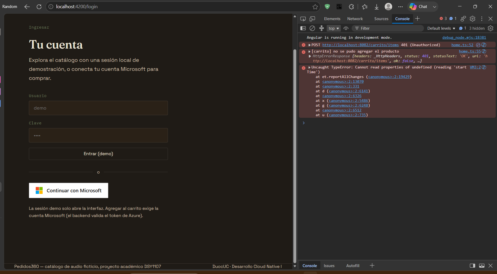
  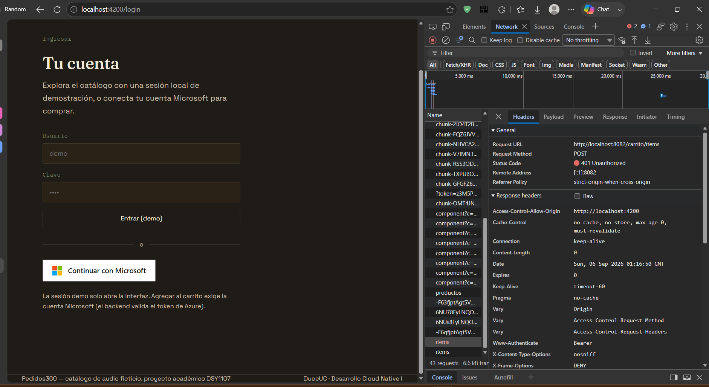
  Qué demuestra: sin sesión no hay token, el backend rechaza con 401 y la
  página lleva al login. Las dos líneas (OPTIONS 200 de permiso + POST 401
  de rechazo) son el comportamiento esperado.
  Cómo repetirla: sin login, en Home o Catálogo pulsar Agregar con la
  consola y la pestaña Red abiertas.

## 3. Roles y administración

- [x] **Panel admin solo para rol Admin**
  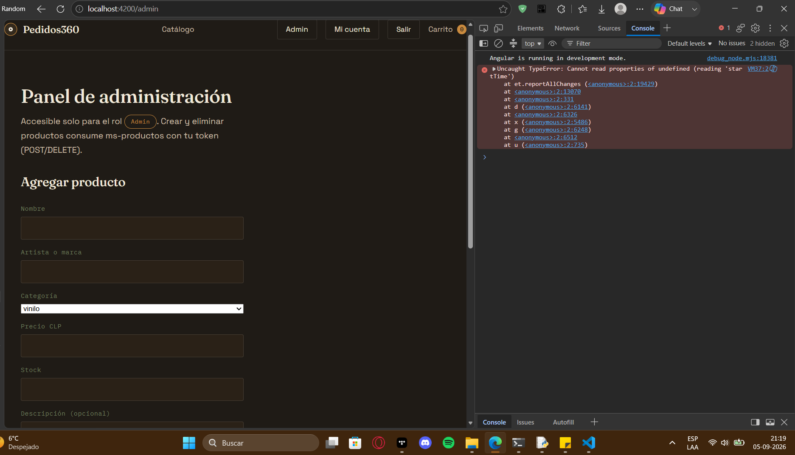
  Qué demuestra: la ruta /admin solo se abre con el rol Admin.
  Cómo repetirla: con sesión Admin, abrir Administración.

- [x] **Crear y eliminar un producto**
  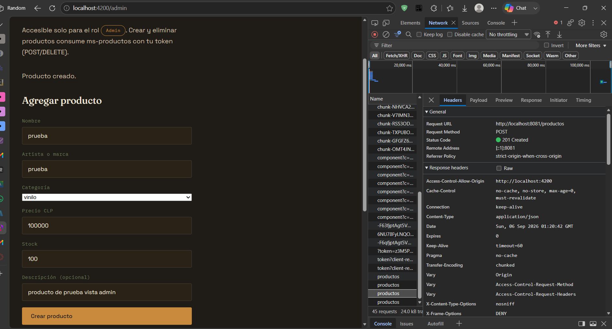
  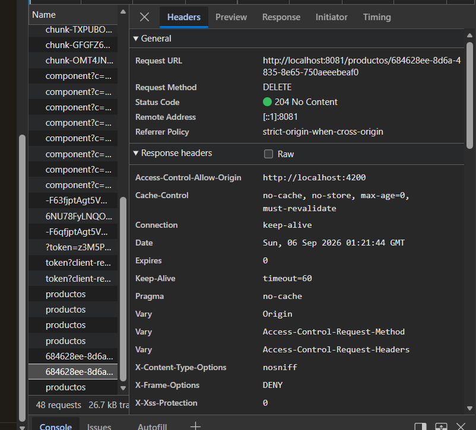
  Qué demuestra: el rol Admin administra el catálogo (ms-productos).
  Cómo repetirla: en Administración, crear un producto de prueba y
  eliminarlo después.

## 4. Microservicios corriendo

- [x] **Bases de datos y servicios arriba**
  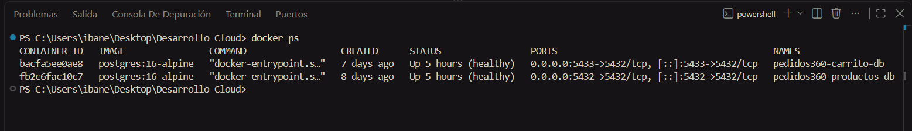
  Qué demuestra: Postgres de productos y carrito corriendo en Docker.
  Cómo repetirla: `docker ps` en el equipo de desarrollo.

- [x] **Catálogo público responde**
  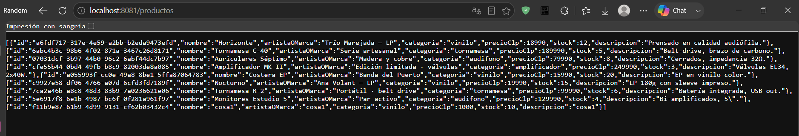
  Qué demuestra: ms-productos responde el catálogo sin login (ruta pública).
  Cómo repetirla: abrir `http://localhost:8081/productos` en el navegador.

## 5. Problemas encontrados y solución

| Problema | Qué pasaba | Solución |
|---|---|---|
| CORS | El navegador bloqueaba las llamadas del frontend a los MS | Permitir `http://localhost:4200` en los 3 MS |
| Token no llegaba | El interceptor no adjuntaba el JWT (versión nueva exige `/*`) | Mapa con `/*` por servicio |
| Rebote al login de Microsoft | Entrar a la home redirigía a Microsoft | El catálogo público no pide token |
| Error NG0203 | `inject()` fuera de contexto al agregar sin login | Inyección como campo de la clase |
| Cuenta personal rechazada | La app solo acepta cuentas del tenant del curso | Invitación de invitado + rol Cliente |
| Sin permiso de registro | La cuenta no administra flujos de usuario del tenant | Lo configura el profesor; invitación como alternativa |

## 6. Fase 3: AWS (2026-09-06, tag v1.1.0)

Todo verificado contra el lab (región `us-east-1`, cuenta `945401641647`).
URLs públicas (no son secretos):
- Frontend https: `https://4zg0frz1qg.execute-api.us-east-1.amazonaws.com/desarrollo/`
- API negocio: `https://13uwepgzy9.execute-api.us-east-1.amazonaws.com/desarrollo`

- [x] **4 EC2 + RDS corriendo**
  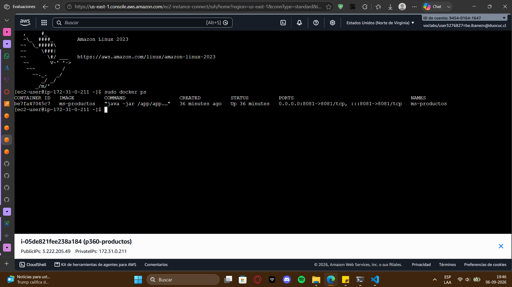
  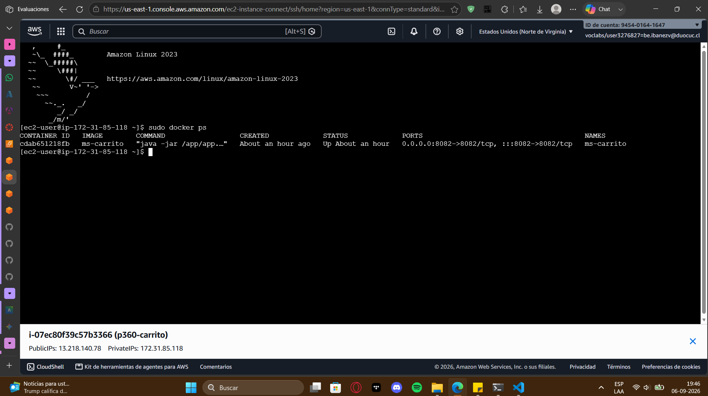
  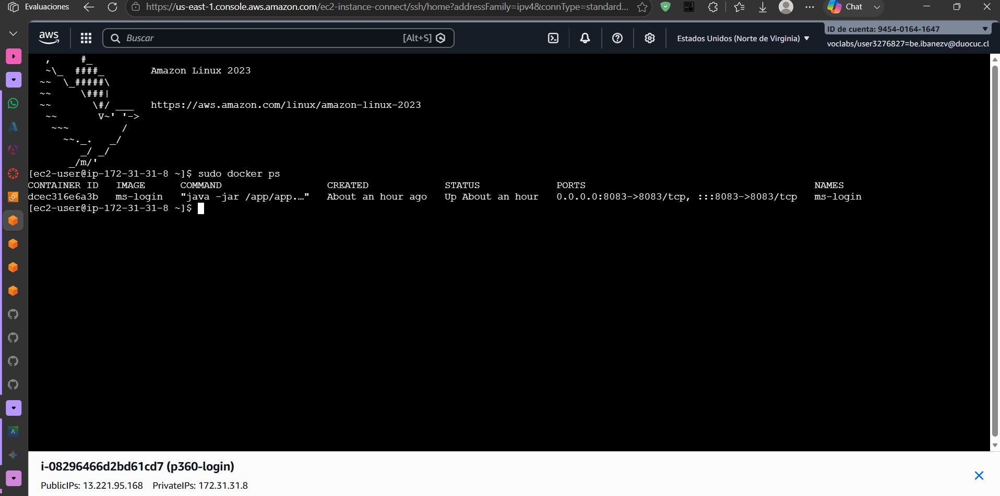
  
  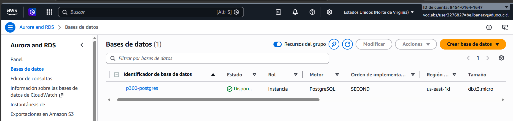
  Qué demuestra: `p360-productos` (3.222.205.49:8081), `p360-carrito`
  (13.218.140.78:8082), `p360-login` (13.221.95.168:8083), `p360-frontend`
  (EIP 52.73.189.238:80), cada una con su contenedor Docker `Up`, y
  `p360-postgres` (db.t3.micro) en estado `available` con las 2 bases
  (`pedidos360_productos`, `pedidos360_carrito`).
  Cómo repetirla: `sudo docker ps` por EC2 Instance Connect en cada EC2 +
  consola RDS.

- [x] **Gateway negocio: 18 rutas Método A + autorizador JWT nativo**
  <!-- foto: evidencias/15-gateway-rutas.png (consola API Gateway con las rutas y el authorizer azure-ad) -->
  Qué demuestra: HTTP API `p360-negocio` con rutas una-por-método
  (`GET /productos` pública; `POST/PUT/DELETE /productos/*`, `/carrito/*`,
  `/login/*` con JWT; 6 rutas `OPTIONS` sin autorizador para el preflight).
  Authorizer `azure-ad`: issuer v1 `https://sts.windows.net/e5372bf0-c5e3-4286-887c-79069f209c1f/`
  (el token real es ver 1.0) y audience `api://446c57cb-aba2-4b7a-ab01-6f2e6af7d35c`.
  CORS cerrado al origen exacto del frontend (sin `*`).
  Cómo repetirla: consola API Gateway → API `p360-negocio` → Routes + Authorizers + CORS.

- [x] **Catálogo público vía Gateway (200 sin token)**
  Qué demuestra: `GET /desarrollo/productos` responde 200 con los 8 productos
  sin Authorization (verificado con `curl`: `200`).
  Cómo repetirla: `curl https://13uwepgzy9.execute-api.us-east-1.amazonaws.com/desarrollo/productos`.

- [x] **Rechazo sin token (401 del authorizer)**
  Qué demuestra: `POST /desarrollo/carrito` y `GET /desarrollo/login/me` sin
  token responden 401 (verificado con `curl`: `401` + `401`).
  Cómo repetirla: mismos `curl` sin header `Authorization`.

- [x] **Rechazo por rol (403 del backend)**
  <!-- foto: evidencias/16-403-cliente.png (consola: POST con token solo-Cliente → 403) -->
  Qué demuestra: con token válido de cuenta solo-Cliente,
  `POST /desarrollo/productos` responde `403` (ms-productos exige rol Admin;
  el Gateway sí dejó pasar el token porque iss/aud/firma son válidos).
  Cómo repetirla: en consola con sesión solo-Cliente, POST con el token del
  caché MSAL (llave con `carrito.readwrite`) → `403`.

- [x] **Escritura Admin (201) y catálogo actualizado (200)**
  <!-- foto: evidencias/17-201-admin.png (red: POST 201 + GET 200 con el producto nuevo) -->
  Qué demuestra: con token de cuenta Admin, `OPTIONS → 200`, `POST → 201` y
  el `GET` siguiente trae el producto creado.
  Cómo repetirla: `/admin` con sesión Admin → crear producto → ver red + catálogo.

- [x] **Login real en la URL https + `/cuenta` con claims**
  <!-- foto: evidencias/18-cuenta-https.png (/cuenta con chips Cliente/Admin, scopes y sección ms-login) -->
  Qué demuestra: Authorization Code + PKCE contra el tenant del curso desde la
  URL https (redirect URI SPA registrada en Azure); `/cuenta` muestra nombre,
  roles, scopes y claims (`ver 1.0`, `iss sts.windows.net/...`, `aud api://...`).
  La sección "Datos desde ms-login" responde vía `GET /login/me` (el error
  "no alcanzable" de la era local ya no sale).
  Cómo repetirla: abrir la URL https → Continuar con Microsoft → abrir Mi cuenta.

- [x] **Frontend https detrás del Gateway (base /desarrollo/)**
  Qué demuestra: `/desarrollo/`, `/desarrollo/catalogo` y los assets
  (`main-*.js`) responden 200; el build prod usa `baseHref /desarrollo/` y
  `apiUrl` del Gateway (la ruta sin slash da `Not Found` del API, esperado).
  Cómo repetirla: abrir la URL https con la consola abierta (sin errores de la app).

## 7. Problemas AWS encontrados y solución

| Problema | Qué pasaba | Solución |
|---|---|---|
| Preflight 401 en rutas con autorizador | El JWT authorizer interceptaba los OPTIONS | 6 rutas `OPTIONS` explícitas sin autorizador hacia los backends |
| 403 "Invalid CORS request" de Spring | El Gateway reenviaba el Origin y el backend solo aceptaba localhost | `CORS_ALLOWED_ORIGINS` por env en los 3 MS |
| POST /productos devolvía 200 sin crear nada | La integración tenía método fijo `GET` y convertía el POST | Integración en modo `ANY` |
| 403 imposible de provocar | El `@PreAuthorize` de carrito era OR con el scope (todas las cuentas pasan) | Escritura de productos exige rol `Admin` (autorización por rol real) |
| Frontend servía la página default de nginx | El build deja la app en `dist/.../browser` y el COPY apuntaba a la raíz | Normalización `browser/` en el Dockerfile |
| Assets y rutas rotas tras el stage | Paths absolutos apuntaban fuera de `/desarrollo/` | `baseHref /desarrollo/` solo en config production |
